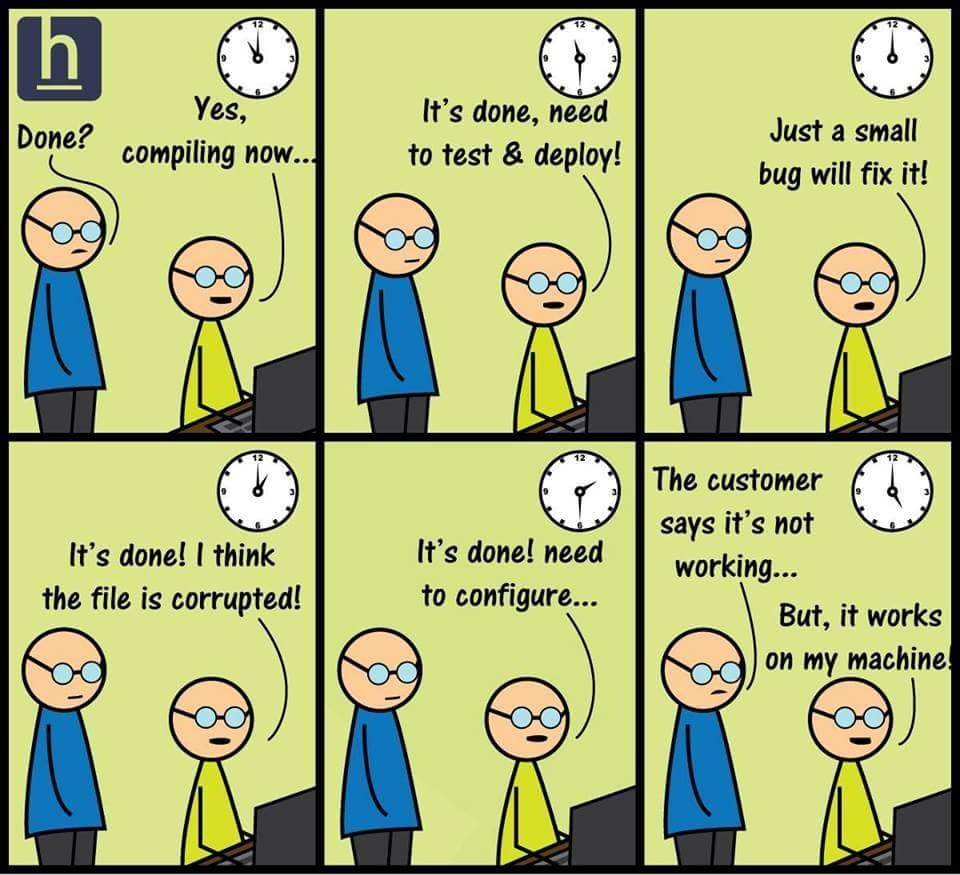

# Education Docker (WIP)

## Table of Contents

- [Why Docker](#why-docker)
- [What is Docker](#what-is-docker)
- [Special File in Docker](#special-file-in-docker)
  - [Dockerfile](#dockerfile)
  - [.dockerignore](#dockerignore)
- [Run a Docker Container](#run-a-docker-container)
- [Build a Docker Image](#build-a-docker-image)
- [Docker Compose](#docker-compose)
- References

## Why Docker

Pada suatu kala di dunia deployment, programmer sering kali memiliki permasalahan ini:




Apakah bila bertemu masalah seperti ini artinya kita harus deploy di komputer programmer tersebut? tentu tidak bukan?

Nah hal inilah yang ingin kita selesaikan dengan menggunakan Docker !

## What is Docker

Docker adalah sebuah program yang bisa kita gunakan untuk membuat sebuah lingkungan yang kita sebut "container". Container ini mirip dengan sebuah kotak kecil yang berisi semua yang kita perlukan untuk menjalankan sebuah program komputer.

Dengan container, kita bisa membuat sebuah lingkungan yang terisolasi di dalam komputer kita, dan kita bisa memasukkan program komputer ke dalam container tersebut. Ini sangat membantu kita untuk membuat program komputer yang bisa berjalan dengan lancar di komputer apapun, karena kita sudah membawa lingkungan yang dibutuhkan oleh program tersebut di dalam container.

Jadi, secara sederhana, docker bisa kita gunakan untuk membuat sebuah "kotak" yang berisi semua yang kita butuhkan untuk menjalankan sebuah program komputer, sehingga program tersebut bisa berjalan dengan lancar di komputer apapun.

Namun sebelum kita bisa membuat container, terlebih dahulu kita membutuhkan sebuah image / cetakan / •blueprint\* dari aplikasi yang ingin dijalankan dalam "kotak" tersebut. Image ini bisa kita buat sendiri, atau kita bisa mendownloadnya dari internet.

Jadi dalam Docker (yang kita ketahui sekarang, ada 3 istilah yang **serupa namun tak sama**):

- `Image` - Cetakan Aplikasi
- `Container` - Kotak di mana Aplikasi berjalan
- `Docker` - Tools untuk membuat dan memanage container

## Special File in Docker

Dalam Docker ini sendiri akan ada banyak file dan perintah yang akan dipelajari, namun untuk saat ini kita akan fokus pada 2 file yang sangat penting dalam Docker, yaitu:

- Dockerfile, yang digunakan untuk membuat sebuah image
- .dockerignore, yang digunakan untuk mengabaikan file yang tidak perlu di include dalam image

### Dockerfile

Dockerfile adalah sebuah file yang berisi perintah-perintah yang akan digunakan untuk membuat sebuah image. Perintah-perintah ini akan dijalankan secara berurutan, dan akan menghasilkan sebuah image yang bisa kita gunakan untuk membuat sebuah container.

### .dockerignore

.dockerignore adalah sebuah file yang berisi daftar file dan folder yang tidak perlu di include dalam image. Anggap saja ini adalah file `.gitignore`, namun untuk Docker.

## Run a Docker Container

Sudah, yuk, cukup dengan teori, mari sekarang kita coba ber-"main" dengan Docker !

Mari kita install Docker terlebih dahulu dengan mengikuti langkah yang ada di sini yah - https://docs.docker.com/get-docker/

Kemudian setelah itu mari kita coba untuk menjalankan aplikasi favorit kita yang bernama .... `Hello World`

Karena kita belum memiliki aplikasi apapun, maka kita akan "meminjam" untuk image yang sudah dibuat oleh komunitas dari sebuah tempat yang bernama `Docker Hub` yah - https://hub.docker.com/

Untuk mengunduh image Hello World yang ada di Docker Hub (https://hub.docker.com/_/hello-world) dan menjalankannya pada Docker local kita, kita bisa menggunakan perintah berikut:

```bash
docker run hello-world
```

Dengan menggunakan perintah ini akan muncul tulisan hello world dalam Docker, kemudian aplikasi akan langsung selesai (berhenti).

Tapi cari ini ada _caveat_ nya loh !

Ketika kita melihat ada proses aplikasi apa saja yang berjalan dengan menggunakan `docker ps -a`, kita akan melihat bahwa container yang dibuat berdasarkan image hello-world tersebut tidak lagi berjalan, namun masih ada !

Untuk bisa menghapus image tersebut maka kita bisa menggunakan perintah `docker rm <container_name>`.

Supaya hal ini tidak terjadi lagi untuk aplikasi sekali jalan seperti ini, kita bisa menggunakan perintah `--rm` untuk menghapus container tersebut setelah aplikasi selesai berjalan.

```bash
docker run --rm hello-world
```

Perintah yang sudah dipelajari:

- `docker run <image_name>`
- `docker ps -a`
- `docker rm <container_name>`

## Build a Docker Image

Sudah, mari skip bagian teorinya dan langsung masuk ke bagian prakteknya yah !

Untuk bisa membuat

## Docker Compose

## References

- https://docs.docker.com/get-started/
- https://docs.docker.com/get-started/02_our_app/
- https://docs.docker.com/get-started/07_multi_container/
- https://docs.docker.com/get-started/08_using_compose/
- [BONUS] https://docs.docker.com/get-started/05_persisting_data/
